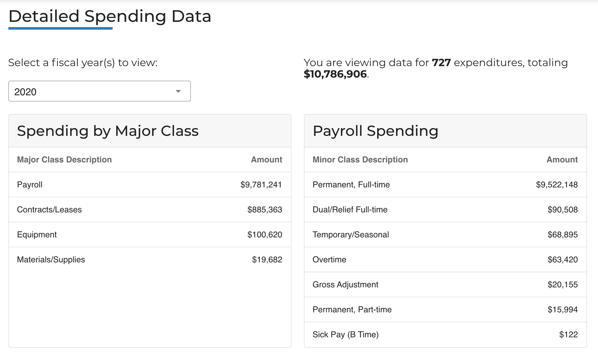
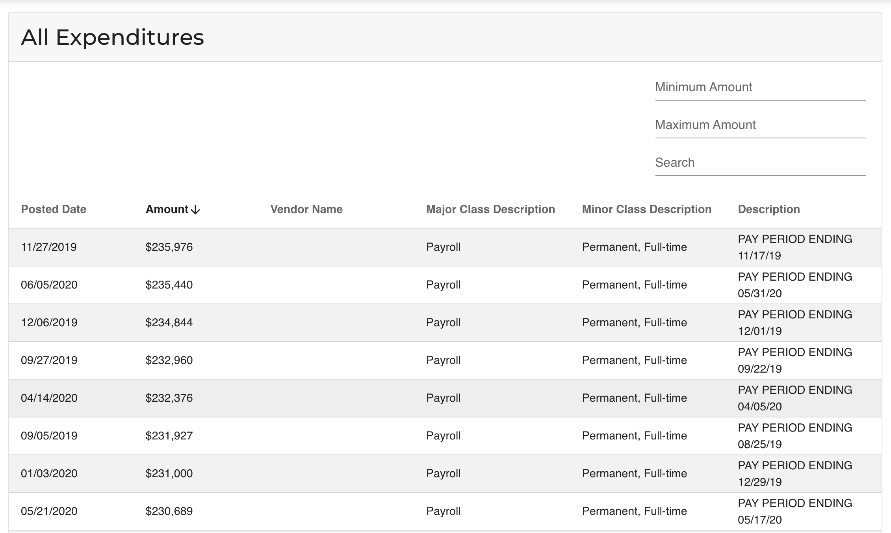

# Data Release: Controller's Office Expenditures

The code behind the interactive dashboard for Controller's Office spending.

Check out the interactive visualization [here](https://controller.phila.gov/philadelphia-audits/controllers-office-expenditures/).





## Tools

The application is built using a combination of open-source tools, including
[vue](https://github.com/vuejs/vue), [vuetify](https://github.com/vuetifyjs/vuetify), and [ApexCharts](https://github.com/apexcharts).

## Development

There are two commands `serve`, which will launch a local development server,
and `build`, which will build the final javascript bundle for the application in the `dist/` folder. 

We also need to specify the `mode` for the build, which can be either `staging` or `production`. This will determine if the data is pulled 
from the "staging" or "production" version of the data files. This allows
us to update the "staging" dataset for the new release, without affecting
the page that is live on the production website. 

### Project setup

Install the dependencies:
```
npm install
```
### Compiles and hot-reloads for development

Load data from the staging database:
```
make serve mode=MODE
```
where MODE is either `staging` or `production`.

### Compiles and minifies for production

Load data from the staging database:
```
make build mode=MODE
```
where MODE is either `staging` or `production`.